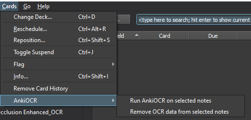
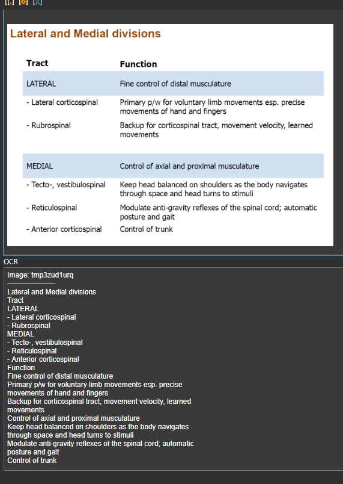

# AnkiOCR
OCR of images in anki cards

## Usage

1. Open the card browser and select the note(s) you want to process. Use the search bar at the top, select tags, decks, etc.

2. On the toolbar at the top, select 'Cards', then 'AnkiOCR', and select 'Run AnkiOCR on selected notes', as shown below

 

3. After processing, the notes will be updated with an additional 'OCR' field with the extracted text, example below:

 

4. If you want to remove the OCR field from any notes, select them and then use the "Remove OCR field from selected notes" option in the menu shown above

## Installation

AnkiOCR depends on [the Tesseract OCR library](https://github.com/tesseract-ocr/tesseract).
This should be installed before going further, [install files can be found here](https://tesseract-ocr.github.io/tessdoc/Home.html).
I have mirrored windows install file for ease of access, [download here](https://github.com/cfculhane/AnkiOCR/raw/master/deps/win/tesseract-ocr-w64-setup-v5.0.0-alpha.20200328.exe) 

AnkiOCR was built on Python 3.8, but should work for Python versions >= 3.6.

It is highly reccomended to to use inside the Anki application, by [installing the addon from AnkiWeb](https://ankiweb.net/shared/info/450181164)
If you want to run it externally to anki, see below:

Then clone the git repo:

`git clone https://github.com/cfculhane/AnkiOCR`

Create a venv, then once activated install requirements:

`pip install -r requirements.txt`

